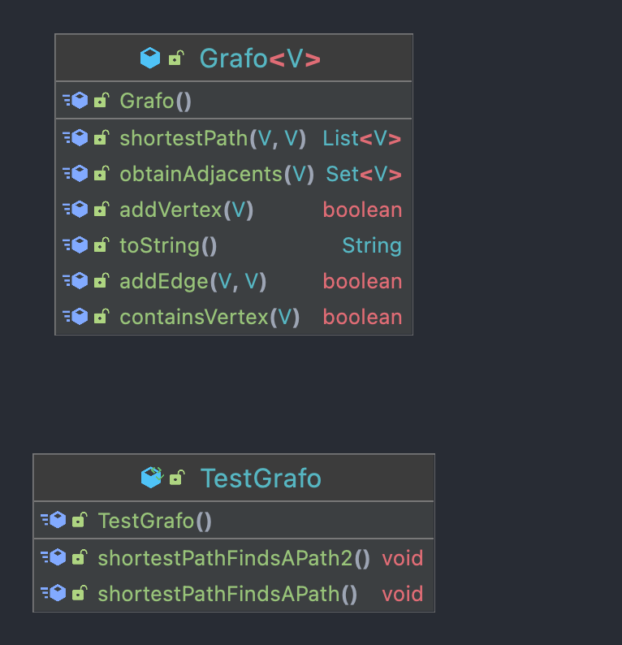
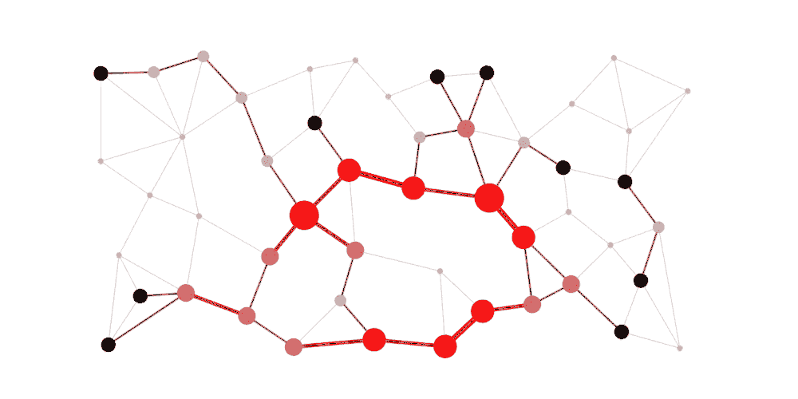

# Practica 5: Cálculo camino más corto entre dos vértices

## Autor y fecha
`Daniel Fernández López`
`27/06/2022`


Copyright [2022] (Daniel Fernández López copyright) Licensed under the Apache License, Version 2.0 (the "License");
you may not use this file except in compliance with the License. You may obtain a copy of the License at:
```
https://www.apache.org/licenses/LICENSE-2.0
```
Unless required by applicable law or agreed to in writing, software distributed under the License is distributed on an
"AS IS" BASIS, WITHOUT WARRANTIES OR CONDITIONS OF ANY KIND, either express or implied. See the License for the specific
language governing permissions and limitations under the License.

## Descripción: 

El objetivo de esta práctica es implementar un algoritmo para calcular el camino más corto entre dos vértices de un grafo, dirigido por puebas y mostrarlo por pantalla.
El software esta desarrollado con _Maven_ y se ha implementado en un repositorio de _GitHub_, con el cual se puede consultar el código fuente.

Un grafo es una estructura matemática de datos que permite representar las conexiones entre sus vértices y sus aristas.
Donde los vértices son también denominados nodos, los cuales almacenan la información y pueden estar relacionados entre sí mediante
una o más aristas.

Hoy en día, los grafos son muy utilizados para representar coordenadas, redes sociales, redes de telecomunicación, etc.
Pero donde mayor influencia tienen es en el sector financiero, ya que optimizan las propuestas de productos y servicios; además de
la segmentación del mercado y la identificación de clientes potenciales.

## Comandos: 

- Compilación:

`$ mvn package` `$ mvn compile`

- Creación jar: 

`$ mvn jar:jar`

- Creación javadoc:

`$ mvn javadoc:javadoc`

## Diagrama Clases:


- 


